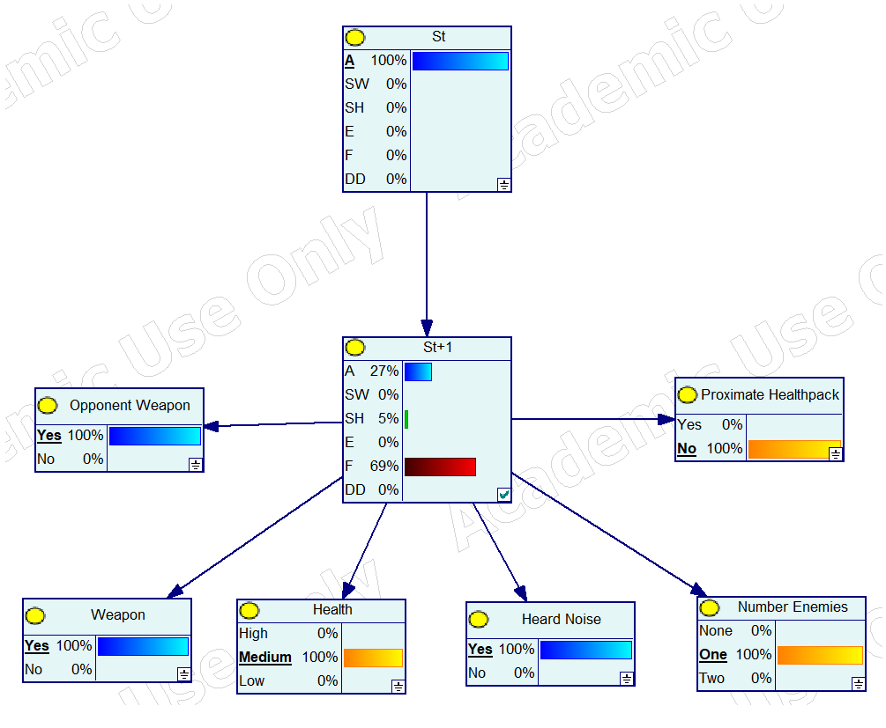

# Seminario II (IAA)

[](https://github.com/alu0101351773/aggresive-bot.git)


## Autores

- Juan Guillermo Zafra Fernández (alu0101353647)
- Jorge Cabrera Rodríguez (alu0101351773)

## Descripción del funcionamiento del programa

### Descripción del problema

Nuestro programa en _python_ hace uso de la librería _SMILE_ para poder
interactuar con la red bayesiana `BotAgresivo.xdsl` creada con la 
herramienta _Genie_.

Sabiendo esto, nos permite preguntar al usuario por terminal el estado
inicial del bot acorde a los siguientes criterios:

- Estado inicial del bot _(St)_.
- Salud actual del bot _(H)_.
- Sonidos cercanos _(Heard\_Noise)_.
- Número de enemigos _(Number\_Enemies)_.
- Oponente con arma _(Opponent\_Weapon)_.
- Pack de salud cercano _(Proximate\_Healthpack)_.
- Arma _(Weapon)_.

Podemos ver un ejemplo de preguntas que realizaría el programa por terminal:

```
Introduce el valor de Health:
 - High
 - Medium
 - Low
High

Introduce el valor de Heard Noise:
 - No
 - Yes
No

Introduce el valor de Number Enemies:
 - None
 - One
 - Two
One

...
```

Una vez averiguado el estado inicial del bot, el programa estima el
comportamiento del mismo en el siguiente instante produciendo un _output_
similar al siguiente:

```
Final results:
A = 99 %
SW = 0 %
SH = 0 %
E = 0 %
F = 1 %
DD = 0 %
```

### Descripción del código

Lo primero que hace el programa es abrir la red en cuestión y preguntar
por las evidencias al usuario haciendo uso de la función `askEvidences()`.

```py
net = pysmile.Network()
net.read_file("BotAgresivo.xdsl")
evidences = askEvidences()
```

La función `askEvidences()` es una función bastante básica que imprime las
preguntas por terminal y almacena las respuestas (en orden) en un array.

```py
def askEvidences():
	evidences = []
	print("Introduce el valor de St:\n - A (attack)\n - SW (switch weapon)\n - SH (switch health)\n" +
	" - E (explore)\n - F (flee)\n - DD (detect danger)")
	evidences.append(input()) 
	print("\nIntroduce el valor de Health:\n - High\n - Medium\n - Low")
	evidences.append(input())
	print("\nIntroduce el valor de Heard Noise:\n - No\n - Yes")
	evidences.append(input())
	print("\nIntroduce el valor de Number Enemies:\n - None\n - One\n - Two")
	evidences.append(input())
	print("\nIntroduce el valor de Opponent Weapon:\n - Yes\n - No")
	evidences.append(input())
	print("\nIntroduce el valor de Proximate Healthpack:\n - Yes\n - No")
	evidences.append(input())
	print("\nIntroduce el valor de Weapon:\n - Yes\n - No")
	evidences.append(input())
	return evidences
```

Acto seguido establecemos las respuestas como evidencias en un bloque 
`try: except:`. En caso de que cualquiera de las respuestas sea inválida 
(sea porque no existe la opción o porque se escribió mal), el programa imprimirá al final de la ronda de preguntas las incorrectas.

```py
for i in range(len(implicated_variables)):
		try:
			net.set_evidence(implicated_variables[i], evidences[i])
		except:
			print(f"The value \"{evidences[i]}\" is not valid for {implicated_variables[i]}")
			error_code = True

if (error_code == True):
    return -1
```

Por último actualizamos la información de la red de acuerdo a las
evidencias obtenidas y obtenemos los valores para el nodo _St\_1_.

```py
net.update_beliefs()
```

```py
beliefs = net.get_node_value("St_1")
```

Para finalizar imprimimos los resultados del bot en el instante _St\_1_
usando un simple bucle `for`.

Los resultados los extraemos usando el método `get_outcome_id()` de la
librería _SMILE_. Este método recibe un estado y una variable y devuelve
el valor de probabilidad para esa variable.

```py
print("\nFinal results:")
# Print the results
for i in range(0, len(beliefs)):
    print(net.get_outcome_id('St_1', i) + " = " + str(round(float(beliefs[i] * 100))) + " %")
```

## Ejemplos del cálculo de St+1 con Genie

Para este ejemplo partamos del siguiente supuesto:

- _St = A_.
- _H = Medium_.
- _Heard\_Noise = Yes_.
- _Number\_Enemies = One_.
- _Opponent\_Weapon = Yes_.
- _Proximate\_Healthpack = No_.
- _Weapon = Yes_.

### Resultados en el _Genie_.



### Resultados en nuestro simulador.

```
Final results:
A = 27 %
SW = 0 %
SH = 5 %
E = 0 %
F = 69 %
DD = 0 %
```